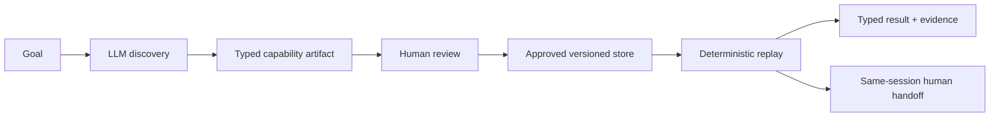
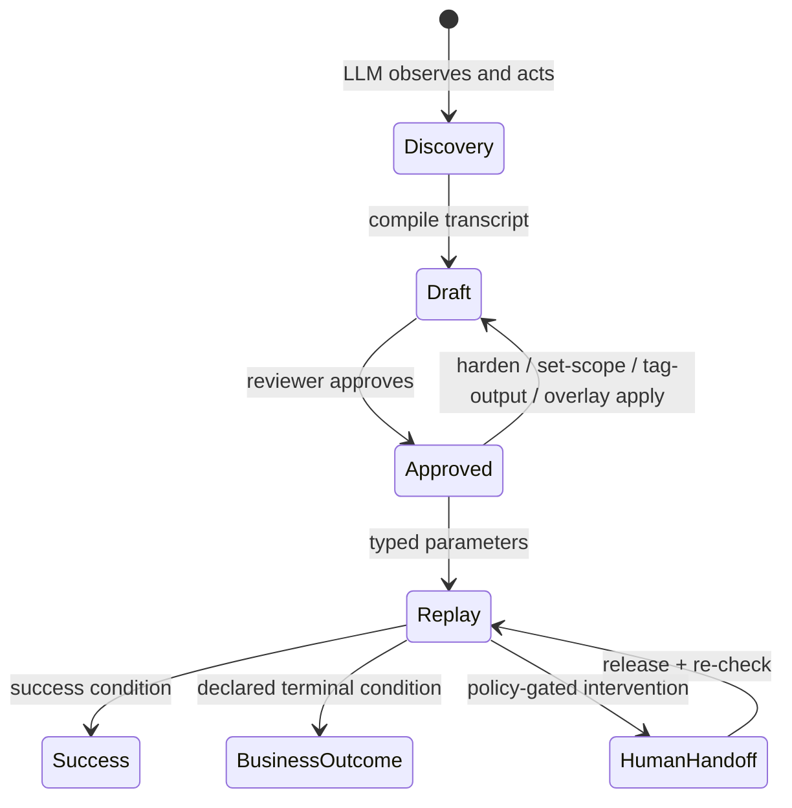

# Computer-Use Automation

> Discover a browser workflow once with an LLM. Review it as a typed, versioned capability. Replay it deterministically—with no LLM in the execution loop.

[Design & implementation](docs/DESIGN_AND_IMPLEMENTATION.md) · [Interview brief](docs/INTERVIEW_BRIEF.md) · [Assignment report](REPORT.md) · [Schema diagrams](docs/schema/) · [Run evidence](evidence/README.md)

Computer-use agents are useful at exploration, but a free-form agent loop is a poor production contract. This project turns a discovered browser workflow into an explicit artifact that a reviewer can inspect, approve, test, and replay safely.



A replayed run reaches this page in the included legacy target app; the browser navigates, searches, opens the result, and reads the balance itself:


## Contents

- [Quick start](#quick-start)
- [Discover a new capability](#discover-a-new-capability)
- [What it guarantees](#what-it-guarantees)
- [Capability lifecycle](#capability-lifecycle)
- [Beyond the happy path](#beyond-the-happy-path)
- [Architecture and contracts](#architecture-and-contracts)
- [Verification](#verification)
- [Repository map](#repository-map)
- [License](#license)

## Quick start

Requires Python 3.12+ and Chromium.

```bash
python3 -m venv .venv
.venv/bin/pip install -e ".[dev]"
.venv/bin/python -m playwright install chromium
```

Start the target application in one terminal:

```bash
.venv/bin/cua serve-target
```

In a second terminal, replay the already-reviewed sample artifact:

```bash
# Valid member: returns a typed Money output
.venv/bin/cua replay \
  --artifact artifacts/acme_core.lookup_savings_balance/2.json \
  -p member_id=12345

# Valid business answer: returns MEMBER_NOT_FOUND, not an exception
.venv/bin/cua replay \
  --artifact artifacts/acme_core.lookup_savings_balance/2.json \
  -p member_id=99999
```

Expected successful result:

```text
status: success
outputs:
{
  "savings_balance": {
    "amount_minor": 816000,
    "currency": "USD"
  }
}
```

Replay and hardening require no API key and never call an LLM. Only discovery does.

## Discover a new capability

This is the assignment's end-to-end demo path: a live LLM run against the target app produces a draft artifact, which is reviewed and replayed.

```bash
cp .env.example .env
# GEMINI_API_KEY -- required for discovery. Free tier: https://aistudio.google.com/apikey
```

```bash
# 1. A live LLM/browser discovery run emits a draft artifact.
.venv/bin/cua discover \
  --goal "look up member 12345 and read their current savings balance" \
  --target http://127.0.0.1:8800/members/search \
  --name lookup_savings_balance

# 2. Review and promote it. Unattended replay refuses drafts.
.venv/bin/cua approve \
  --artifact artifacts/acme_core.lookup_savings_balance/1.json

# 3. Replay the artifact discovery itself just produced.
.venv/bin/cua replay \
  --artifact artifacts/acme_core.lookup_savings_balance/1.json \
  -p member_id=12345
```

A happy-path discovery run never sees "no such member," so step 1's artifact declares no business outcomes yet. `cua harden` closes that deterministically -- no LLM, a deliberately bad input, and only the condition actually observed gets recorded -- which is how the `2.json` used in Quick start was produced from `1.json`:

```bash
.venv/bin/cua harden \
  --artifact artifacts/acme_core.lookup_savings_balance/1.json \
  -p member_id=99999 \
  --detect-text "No member records match" \
  --outcome-code MEMBER_NOT_FOUND
.venv/bin/cua approve \
  --artifact artifacts/acme_core.lookup_savings_balance/2.json
```

## What it guarantees

| Property | How it is enforced |
| --- | --- |
| **No LLM in replay** | `cua replay` takes only an approved artifact, typed inputs, policy, and browser adapter. Tests block discovery and outbound TCP during replay. |
| **Reviewable behavior** | A Pydantic capability declares typed inputs and outputs, ordered steps, locators, success conditions, and recovery rules. |
| **Safe execution** | The executor enforces scope, derives risk from the live target, bounds recovery, and distinguishes business outcomes from failures. |
| **Auditable intervention** | A leased SQLite handoff keeps the same browser session alive, then rechecks the page and policy before resuming. |

## Capability lifecycle



## Beyond the happy path

The discover → approve → replay flow above is the core loop; a few other operations build on it. Each has a real, captured run -- exact commands and result -- in [evidence/README.md](evidence/README.md), and its design rationale in [docs/DESIGN_AND_IMPLEMENTATION.md](docs/DESIGN_AND_IMPLEMENTATION.md):

- **Scope narrowing** (`cua set-scope`) restricts an artifact to specific origins/routes and re-requires approval.
- **Tenant overlays** (`cua overlay apply`) resolve a base capability plus a version-pinned per-tenant patch into a new, independently reviewed artifact -- reusing one capability across heterogeneous markup.
- **Drift detection** (`cua drift-report`) aggregates which locator layer resolved each step across every completed run, surfacing brittle steps before they break.
- **Human handoff** pauses replay *or* discovery in the live browser session (`cua ops claim <run_id>` / `cua ops release <run_id>`) rather than failing outright; discovery-side handoffs additionally require `cua validate` before `cua approve` will accept them, since part of the run was driven by a human, not the LLM.

## Architecture and contracts

The detailed technical narrative is in [docs/DESIGN_AND_IMPLEMENTATION.md](docs/DESIGN_AND_IMPLEMENTATION.md). The contract diagrams are generated from the Pydantic JSON Schema and committed for review:

| Diagram | What it shows |
| --- | --- |
| [Artifact contract](docs/schema/artifact-contract.svg) | Typed containment between capability models. |
| [Semantic references](docs/schema/semantic-references.svg) | Step IDs, ordering, input templates, and output dependencies. |
| [Replay result contract](docs/schema/replay-result-contract.svg) | The typed terminal result variants. |
| [Tenant overlay contract](docs/schema/overlay-contract.svg) | The constrained overlay model. |

## Verification

```bash
.venv/bin/python -m pytest -q
.venv/bin/python -m ruff check src tests
```

Tests cover artifact validation, replay safety and outcome ordering, scope/risk policy, bounded recovery, handoff ownership (both replay- and discovery-side), pre-approval validation, overlays, drift reporting, and a real Chromium end-to-end path from target-app fixture data to typed `Money` output.

## Repository map

| Path | Responsibility |
| --- | --- |
| `src/cua/target_app/` | The included proxy target: a mock legacy credit-union servicing console. |
| `src/cua/agent/` | LLM-only discovery, compilation, and hardening workflow. |
| `src/cua/schema/` | Pydantic capability, overlay, and replay-result contracts. |
| `src/cua/surface/` | `SurfaceAdapter` protocol, the locator-ladder resolver, and the Playwright `WebAdapter`. |
| `src/cua/replay/` | Deterministic engine and terminal-match evaluation. |
| `src/cua/safety/` | Allowlist, scope, risk, bounds, and redaction enforcement. |
| `src/cua/escalation/` | SQLite control-transfer state and human evidence. |
| `artifacts/` and `overlays/` | Versioned reviewed behavior and tenant-specific deltas. |
| `evidence/` | Captured discovery, replay, and handoff records. |

For the concise evaluator narrative, start with [docs/INTERVIEW_BRIEF.md](docs/INTERVIEW_BRIEF.md). For the complete design, start with [docs/DESIGN_AND_IMPLEMENTATION.md](docs/DESIGN_AND_IMPLEMENTATION.md).

## License

[MIT](LICENSE)
