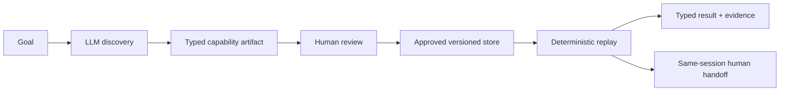
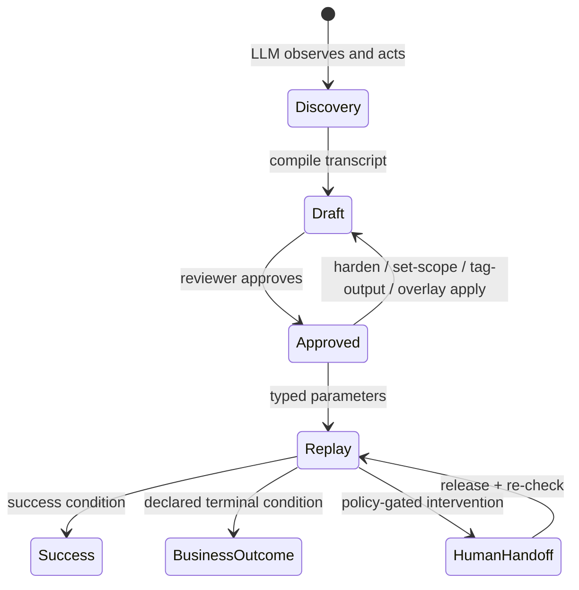

# Computer-Use Automation

> Discover a browser workflow once with an LLM. Review it as a typed, versioned capability. Replay it deterministically—with no LLM in the execution loop.

[Design & implementation](docs/DESIGN_AND_IMPLEMENTATION.md) · [Interview brief](docs/INTERVIEW_BRIEF.md) · [Assignment report](REPORT.md) · [Schema diagrams](docs/schema/) · [Run evidence](evidence/README.md)

Computer-use agents are useful at exploration, but a free-form agent loop is a poor production contract. This project turns a discovered browser workflow into an explicit artifact that a reviewer can inspect, approve, test, scope, and replay safely.



## What it guarantees

| Property | How it is enforced |
| --- | --- |
| **No LLM in replay** | `cua replay` takes only an approved artifact, typed inputs, policy, and browser adapter. Tests block discovery and outbound TCP during replay. |
| **Reviewable behavior** | A Pydantic capability declares inputs, outputs, ordered steps, locators, success conditions, terminal outcomes, and recovery. |
| **Safe failure semantics** | Business outcomes, recoverable conditions, hard failures, and human handoffs have distinct typed results. |
| **Executor-owned safety** | Scope is the intersection of global policy, artifact profile, and optional tenant scope; the executor derives risk from the live target. |
| **Resilient targeting** | Each control has a semantic-to-structural locator ladder; the chosen layer becomes drift evidence. |
| **Auditable handoff** | A leased SQLite state machine lets an operator act in the existing headed browser, then rechecks page and policy before resuming. |

The included target is a local legacy credit-union servicing console. It looks up a member and reads their current savings balance, including a declared `MEMBER_NOT_FOUND` business outcome.

## Quick start

Requires Python 3.11+ and Chromium.

```bash
python3 -m venv .venv
.venv/bin/pip install -e ".[dev]"
.venv/bin/python -m playwright install chromium
```

Start the target application in one terminal:

```bash
.venv/bin/cua serve-target
```

In a second terminal, replay the already-reviewed sample artifact:

```bash
# Valid member: returns a typed Money output
.venv/bin/cua replay \
  --artifact artifacts/acme_core.lookup_savings_balance/2.json \
  -p member_id=12345

# Valid business answer: returns MEMBER_NOT_FOUND, not an exception
.venv/bin/cua replay \
  --artifact artifacts/acme_core.lookup_savings_balance/2.json \
  -p member_id=99999
```

Replay and hardening require no API key and never call an LLM. Only discovery does.

## Capability lifecycle



### Discover, review, and harden a workflow

Create `.env` only if you want to run discovery:

```bash
cp .env.example .env
# GEMINI_API_KEY -- required for discovery. Free tier: https://aistudio.google.com/apikey
# GROQ_API_KEY -- optional secondary provider, used only if the Gemini call
# itself fails. Free tier: https://console.groq.com/keys
```

```bash
# A live LLM/browser discovery run emits a draft artifact.
.venv/bin/cua discover \
  --goal "look up member 12345 and read their current savings balance" \
  --target http://127.0.0.1:8800/members/search \
  --name lookup_savings_balance

# Review and promote the artifact. Unattended replay refuses drafts.
.venv/bin/cua approve \
  --artifact artifacts/acme_core.lookup_savings_balance/1.json

# Replay deliberately bad input without an LLM, then add only the condition
# that was actually observed. Hardening creates a new draft version.
.venv/bin/cua harden \
  --artifact artifacts/acme_core.lookup_savings_balance/1.json \
  -p member_id=99999 \
  --detect-text "No member records match" \
  --outcome-code MEMBER_NOT_FOUND
.venv/bin/cua approve \
  --artifact artifacts/acme_core.lookup_savings_balance/2.json
```

Discovery's own tool set matches everything replay can execute: `navigate`/`click`/`type`/`read`, plus `select` (a dropdown, by its visible option label) and `wait` (an explicit wait for text to appear, never a fixed sleep). A required branch selector or a genuinely slow-loading page -- like the one the `cu_northgate` overlay below adds by hand -- can now be *discovered* directly, not only authored into an overlay after the fact.

Changing scope or output sensitivity likewise returns an artifact to `draft`, so the changed contract is reviewed before replay. (If discovery itself stalls and needs a human handoff to finish, see **Human handoff** below -- including what that means for approving the result.)

## Operations

### Scope, tenant variations, and UI drift

An artifact can only narrow deployment policy. Its effective destination scope is:

```text
global allowlist ∩ artifact app profile ∩ optional tenant scope
```

**Narrow an artifact's own scope**, independent of any tenant. `set-scope` preflights against the capability's own steps and refuses (unless `--force`) to save a scope that would already exclude one of them; it becomes `draft` for the same reason `harden` does, so it needs its own re-approval:

```bash
.venv/bin/cua set-scope \
  --artifact artifacts/acme_core.lookup_savings_balance/1.json \
  --base-url http://127.0.0.1:8800 \
  --allowed-route-pattern "/members/*"
.venv/bin/cua approve \
  --artifact artifacts/acme_core.lookup_savings_balance/1.json
```

**Reuse the same capability across tenants.** A tenant overlay is a version-pinned *patch* (deltas only -- most tenants have an empty one), resolved into a new artifact that is validated again and reviewed independently of its base:

```bash
.venv/bin/cua overlay apply \
  --base artifacts/acme_core.lookup_savings_balance/2.json \
  --overlay overlays/acme_core.lookup_savings_balance/cu_northgate.json
.venv/bin/cua approve \
  --artifact artifacts/acme_core.lookup_savings_balance.cu_northgate/1.json

# Same capability, same outputs shape, replayed against a SECOND tenant's
# markup it was never recorded on (different labels, a real HTML5-required
# branch selector, a differently-classed detail control).
.venv/bin/cua replay \
  --artifact artifacts/acme_core.lookup_savings_balance.cu_northgate/1.json \
  -p member_id=12345 -p branch=main
# -> status: success, typed Money output
```

**Check for UI drift** across every completed run (both tenants included), grouped by capability and step:

```bash
.venv/bin/cua drift-report
```

### Human handoff

If policy requires a person, replay pauses in the existing headed browser rather than continuing autonomously. The operator claims the run, acts directly in that browser, and releases it; replay then rechecks its page and safety conditions.

To actually trigger this end to end rather than just read about it, `--fault` injects a real failure for one run without touching the saved artifact:

```bash
# Terminal 1: force a real HTTP 500 on the entry page, with handoff enabled (the default)
.venv/bin/cua replay \
  --artifact artifacts/acme_core.lookup_savings_balance/2.json \
  -p member_id=12345 \
  --fault "inject=500"
# stalls with: "if this run gets stuck: cua ops claim <run_id> ..."

# Terminal 2, once it's stuck: claim it, then fix it by hand in the
# already-open browser window (e.g. reload the URL without ?inject=500)
.venv/bin/cua ops claim <run_id>
.venv/bin/cua ops release <run_id> --note "reloaded without ?inject=500"
# the waiting Terminal 1 process notices, re-checks its checkpoint, and
# resumes to SUCCESS with the same typed balance output
```

The note is evidence, not an instruction: `human_action.json` records before/after browser state and a *derived* resume decision that doesn't always agree with it (see `evidence/replay-20260915230202/`, where they disagree on purpose).

`cua discover` handles a stall the same way, except `release` there takes `--resolution cleared_obstacle|workflow_advanced` instead of a free-text note -- discovery has no checkpoint yet to derive a resume point from, so the operator states it explicitly. `cleared_obstacle` resumes the LLM; `workflow_advanced` aborts with no artifact (see `evidence/discovery-handoff-*/`).

A `cleared_obstacle` run also needs `cua validate --artifact <path> -p key=value` before `cua approve --artifact <path> --validation-run <id>` will accept it -- some of its steps ran on a page a human already touched, so nothing has proven it replays unattended yet.

## Architecture and contracts

The detailed technical narrative is in [docs/DESIGN_AND_IMPLEMENTATION.md](docs/DESIGN_AND_IMPLEMENTATION.md). The contract diagrams are generated from the Pydantic JSON Schema and committed for review:

| Diagram | What it shows |
| --- | --- |
| [Artifact contract](docs/schema/artifact-contract.svg) | Typed containment between capability models. |
| [Semantic references](docs/schema/semantic-references.svg) | Step IDs, ordering, input templates, and output dependencies. |
| [Replay result contract](docs/schema/replay-result-contract.svg) | The typed terminal result variants. |
| [Tenant overlay contract](docs/schema/overlay-contract.svg) | The constrained overlay model. |

## Verification

```bash
.venv/bin/python -m pytest -q
.venv/bin/python -m ruff check src tests

# Optional: regenerate and verify checked-in schema diagrams (Graphviz required)
.venv/bin/python scripts/render_schema_graph.py
.venv/bin/python scripts/render_schema_graph.py --check
```

Tests cover artifact validation, replay safety and outcome ordering, scope/risk policy, bounded recovery, handoff ownership (both replay- and discovery-side), pre-approval validation, overlays, drift reporting, and a real Chromium end-to-end path from target-app fixture data to typed `Money` output.

## Repository map

| Path | Responsibility |
| --- | --- |
| `src/cua/target_app/` | The included proxy target: a mock legacy credit-union servicing console (FastAPI + server-rendered templates), plus a second tenant variant for the overlay demo. |
| `src/cua/agent/` | LLM-only discovery, compilation, and hardening workflow. |
| `src/cua/schema/` | Pydantic capability, overlay, and replay-result contracts. |
| `src/cua/surface/` | `SurfaceAdapter` protocol, the locator-ladder resolver, and the Playwright `WebAdapter`. |
| `src/cua/replay/` | Deterministic engine and terminal-match evaluation. |
| `src/cua/safety/` | Allowlist, scope, risk, bounds, and redaction enforcement. |
| `src/cua/escalation/` | SQLite control-transfer state and human evidence. |
| `src/cua/overlay/` | Resolves a base artifact + a tenant overlay into a new, re-validated draft artifact. |
| `src/cua/observability/` | Cross-run locator-layer drift detection. |
| `artifacts/` and `overlays/` | Versioned reviewed behavior and tenant-specific deltas. |
| `evidence/` | Captured discovery, replay, and handoff records. |

For the concise evaluator narrative, start with [docs/INTERVIEW_BRIEF.md](docs/INTERVIEW_BRIEF.md). For the complete design, start with [docs/DESIGN_AND_IMPLEMENTATION.md](docs/DESIGN_AND_IMPLEMENTATION.md).
