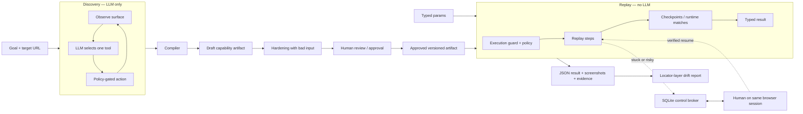
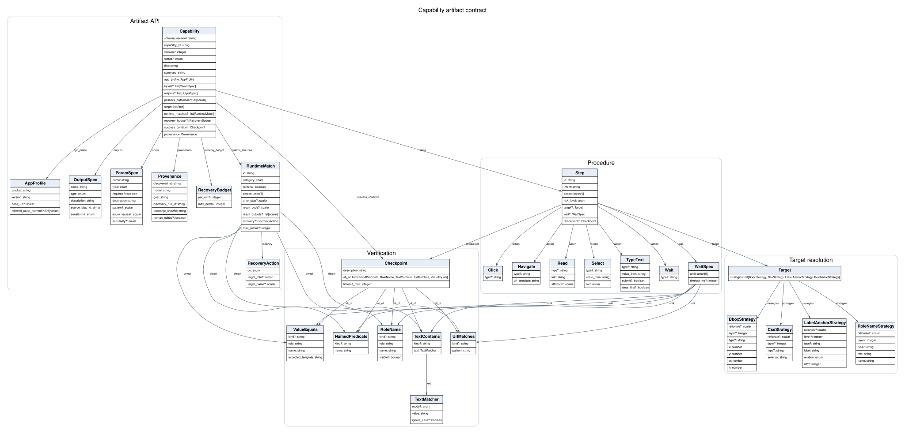
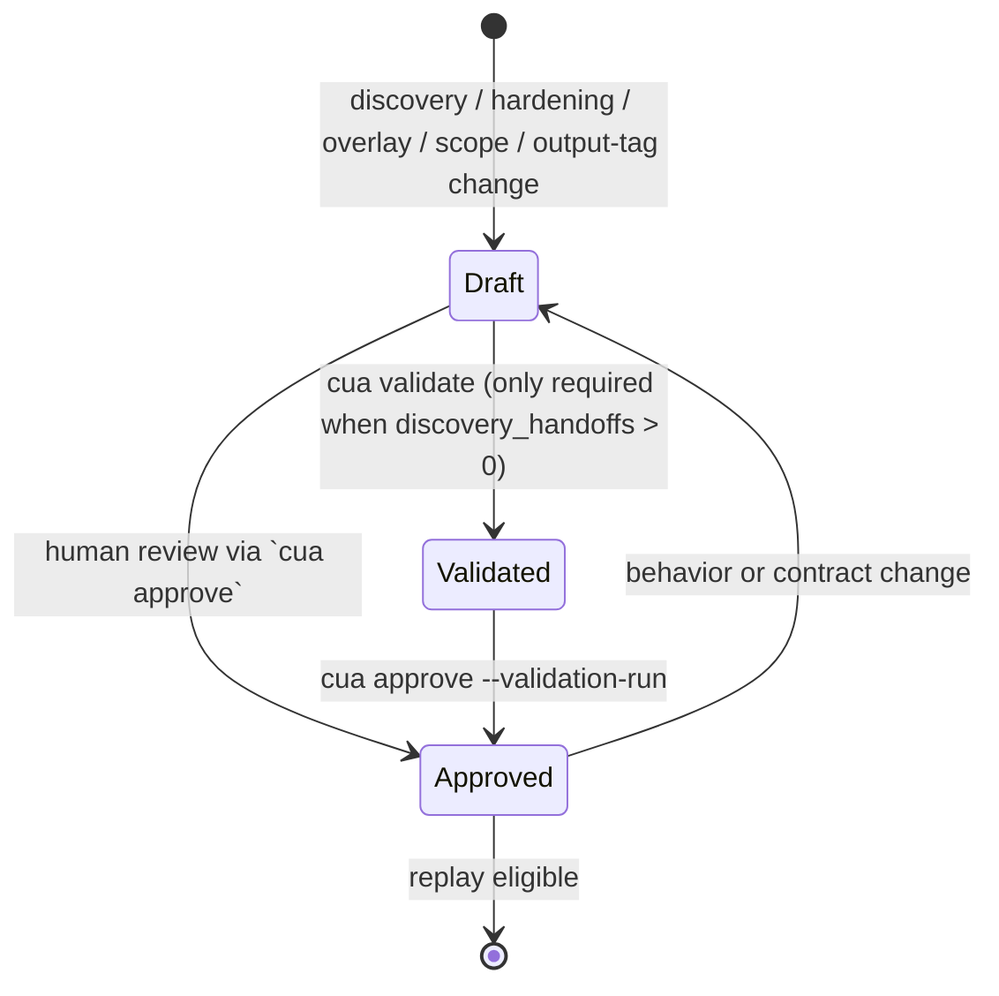
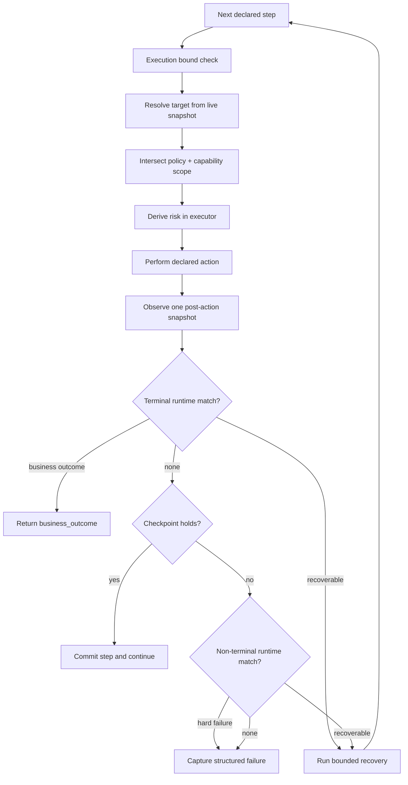
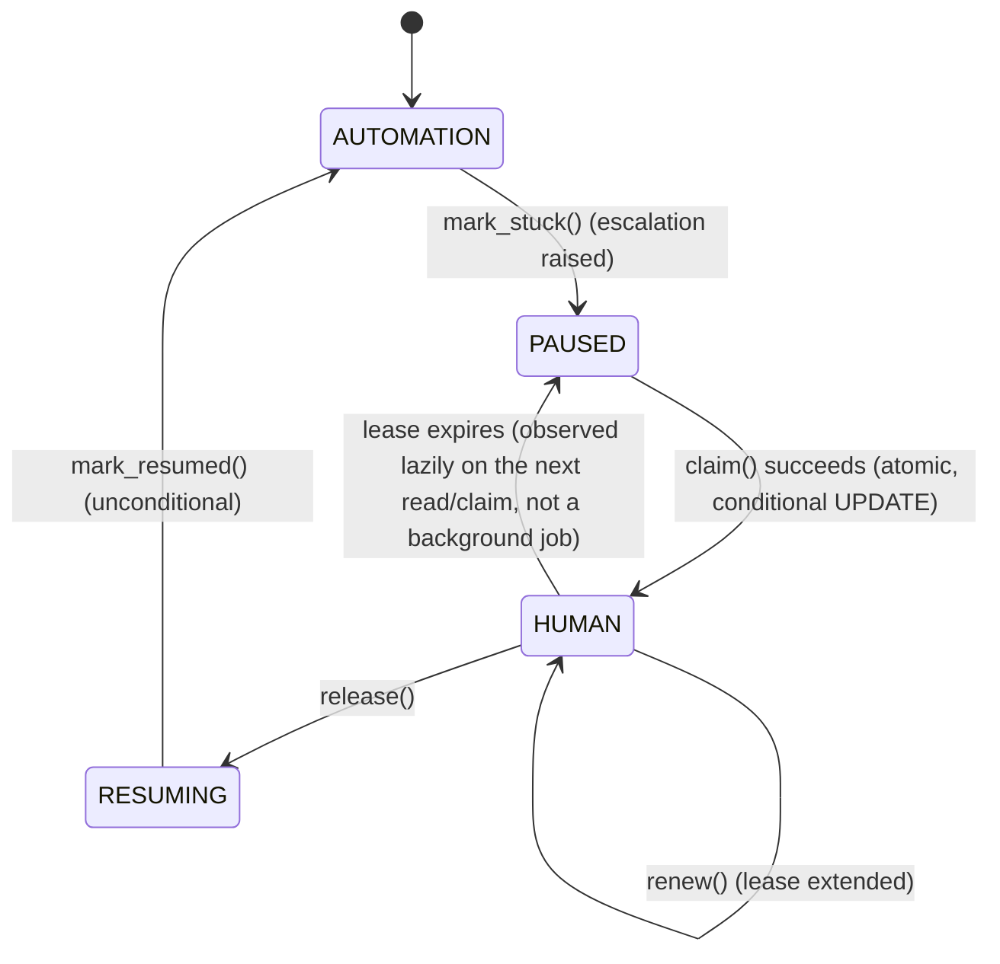

# Design & Implementation

> An LLM learns a browser task once. The resulting capability artifact is then
> reviewed, versioned, and replayed deterministically—without an LLM in the
> production execution path.

This is the implementation-focused document for the project. It maps each
design decision to the module that enforces it.

## Contents

1. [Problem, scope, and invariants](#1-problem-scope-and-invariants)
2. [System architecture](#2-system-architecture)
3. [The capability artifact](#3-the-capability-artifact)
4. [Discovery and compilation](#4-discovery-and-compilation)
5. [Deterministic replay](#5-deterministic-replay)
6. [Targeting a control without binding to one DOM](#6-targeting-a-control-without-binding-to-one-dom)
7. [Outcomes, failures, and bounded recovery](#7-outcomes-failures-and-bounded-recovery)
8. [Runtime safety model](#8-runtime-safety-model)
9. [Human handoff is a state machine](#9-human-handoff-is-a-state-machine-not-a-browser-escape-hatch)
10. [Change management: overlays and drift evidence](#10-change-management-overlays-and-drift-evidence)
11. [Verification strategy and evidence](#11-verification-strategy-and-evidence)
12. [Known gaps: catalog and app-profile enforcement](#12-known-gaps-catalog-and-app-profile-enforcement)
13. [Repository guide and deliberate boundaries](#13-repository-guide-and-deliberate-boundaries)

---

## 1. Problem, scope, and invariants

Many operational systems expose a browser UI but no safe API for the procedure
an agent needs to perform. Letting an LLM operate that UI for every request is
expensive, nondeterministic, hard to audit, and unsafe around writes.

This project separates **learning a procedure** from **executing a reviewed
procedure**.

| Phase | Input | Decision maker | Output |
| --- | --- | --- | --- |
| Discovery | Natural-language goal and live UI | LLM | Discovery transcript |
| Compilation | Successful transcript | Deterministic compiler | Draft capability artifact |
| Hardening | Artifact plus deliberately bad input | Deterministic replay and classifier | Observed runtime rule |
| Replay | Approved artifact and typed parameters | Deterministic executor | Typed result or structured failure |
| Handoff | A stopped replay and its live browser | Human operator | Mechanically verified resume decision |

The target is a deliberately legacy-style credit-union servicing console. The
demo flow searches for a member, opens the detail page, and reads a savings
balance. It exercises a multi-step path, legacy targeting, expected business
outcomes, and policy enforcement; it is not presented as a production banking
integration.

### Non-negotiable invariants

1. **Replay does not ask a model what to do.** The artifact is the plan.
2. **An artifact is a contract, not a transcript.** It has typed I/O,
   reviewable targeting, declared outcomes, provenance, and a version.
3. **The executor owns permission.** An artifact can describe risk but cannot
   authorize an action or widen policy.
4. **A business result is not a system error.** “Member not found” is a valid
   result shape when declared by the artifact.
5. **A failed action is not assumed to be unapplied.** Potential writes are not
   automatically retried merely because a checkpoint failed.
6. **Human intervention keeps the same session alive.** Handoff changes the
   owner of a browser; it does not open a replacement browser.

---

## 2. System architecture



### Component boundaries

| Boundary | Contract | Concrete implementation |
| --- | --- | --- |
| Model provider | `LLMProvider.decide(messages, tools)` | Gemini primary, Groq fallback in `src/cua/agent/providers/` |
| Surface | Observe, resolve, act, wait, locate, screenshot | `SurfaceAdapter`; Playwright `WebAdapter` |
| Artifact | Typed, validated, versioned capability | Pydantic models in `src/cua/schema/` |
| Executor | Artifact + params + surface + policy → result | `src/cua/replay/engine.py` |
| Policy | Allowlist, scope narrowing, risk, bounds, redaction | `src/cua/safety/` and `config/policy.yaml` |
| Control transfer | Atomic state ownership for a run | SQLite-backed `ControlBroker` |

The important architectural boundary is between `agent/` and `replay/`.
Discovery may call an LLM. Replay consumes only artifact data, caller
parameters, the live-surface adapter, and policy; it has no planner or model
provider dependency.

---

## 3. The capability artifact

An artifact is saved as one JSON file per capability version:

```text
artifacts/<capability_id>/<version>.json
```

Git is therefore the review and version history: a change to a target, business
outcome, or output sensitivity appears as a normal artifact diff.

### Three audiences, one file

| Reader | Reads first | Needs to learn |
| --- | --- | --- |
| Calling agent | `summary`, `inputs`, `outputs`, `possible_outcomes` | Can I invoke this and what may come back? |
| Reviewer | Identity, scope, steps, risk hints, conditions, provenance | What will happen and why is it safe? |
| Replay executor | Steps, targets, runtime matches, checkpoints | What deterministic procedure should run? |

### Contract sections

| Section | Examples | Why it exists |
| --- | --- | --- |
| Identity | `schema_version`, `capability_id`, `version`, `status` | Separates file-format compatibility, artifact revisions, and approval. |
| App profile | Product/build plus optional base URL and route patterns | Identifies the UI and narrows the permitted surface. |
| Inputs | Type, required flag, pattern, `enum_values`, sensitivity | Rejects invalid calls before a browser is touched. |
| Outputs | Type, source `Read` step, sensitivity | Gives callers a stable typed result contract. |
| Ordered steps | Action, target, input/ctx reference, checkpoint | Makes the executable procedure reviewable. |
| Runtime matches | Business outcome, recovery, hard failure | Represents known non-happy paths as data. |
| Provenance | Model, discovery run ID, transcript digest | Audits how the artifact was learned without using transcripts to execute it. |

### References and values

Concrete recording-time values are deliberately absent from executable bindings.

| Reference | Source | Lifetime |
| --- | --- | --- |
| `{{input.member_id}}` | Caller | One invocation |
| `{{ctx.token}}` | A prior `Read` in the same run | In-memory only |
| Declared output | Named `Read` step | Returned after redaction and type conversion |

Cross-field validation rejects undeclared inputs, forward `ctx` references,
wrong output producers, duplicate step IDs, invalid runtime references, and
declared business outcomes that no runtime rule can produce.

### Contract diagram

The following diagram is generated from the Pydantic models rather than kept by
hand:



The [semantic-reference diagram](schema/semantic-references.svg) complements it
with the string references—step IDs and `input`/`ctx` bindings—validated by the
artifact validators.

### Lifecycle



Any operation that changes executable behavior or what a caller may receive
resets the artifact to `draft`: hardening, tenant resolution, output sensitivity
tagging, and scope changes all require review again. A draft whose
`provenance.discovery_handoffs > 0` (a human took the wheel during discovery
at least once, see Section 9) cannot skip straight to `cua approve`: some of
its steps ran on a page a human already reached into, so nothing has proven
they hold up unattended yet. `cua validate` supplies that proof -- a
fresh-session, escalation-disabled replay -- and `cua approve
--validation-run <id>` checks it (a content hash, capability id, version,
and a clean handoff count) before promoting.

---

## 4. Discovery and compilation

### Discovery loop

`run_discovery()` executes one model tool call per turn:

```text
observe surface → render visible nodes → model selects one tool
→ allowlist check → risk gate → perform action → record step
```

The model receives a compact text view of the current location and visible
interactive/textual nodes. It selects by observed `node_id`, rather than
inventing a CSS selector. Discovery's tools mirror every action replay itself
can execute — `navigate`, `click`, `type`, `read`, `select`, `wait`, and
`finish` — so nothing schema and replay support is structurally undiscoverable
(a required dropdown, or an explicit wait for a slow page, can now be learned
the same way a `click` can). `select`/`wait` reuse `type`'s own reference-
binding and literal-redaction path (`extract_param_literals`/
`template_literals`): a chosen option is bound as `{{input.<param_name>}}`,
never the literal, exactly like typed text.

Before the first navigation, the CLI-provided target URL goes through the same
allowlist check as model-requested navigation. Discovery shares the executor’s
step count, wall-clock, and no-progress bounds. An irreversible action is
refused during discovery; there is no “exploration bypass.”

### Compiler responsibilities

`compile_capability()` converts a successful `DiscoveryTranscript` into a draft
artifact. It is the trust boundary between transient model output and durable
automation data.

| Transcript fact | Compiler output |
| --- | --- |
| Typed literal for a declared parameter | `{{input.<name>}}`, never the literal |
| Node with role + accessible name | Layer-1 role/name target |
| Unnamed node beside one static row label | Layer-2 label-anchor target |
| Node with a stable class | Layer-3 CSS fallback |
| No semantic or structural signal | Layer-4 bounding-box fallback |
| Currency-shaped value | `money` output type |
| Later page heading | Step checkpoint |
| `select`'s chosen option | `{{input.<name>}}` (reference-bound, same as `type`), never the literal label |
| `wait`'s target text | `WaitSpec(until=TextContains(...), timeout_ms=...)` on the step, action `Wait()` |

The compiler templates known parameter literals out of the goal and summary.
The CLI also redacts discovery evidence at its persistence boundary: transcript
outputs are treated as unclassified and masked until a reviewed output contract
exists.

### Hardening is a separate deterministic pass

A happy-path discovery cannot learn what a “not found” page looks like. The
`cua harden` workflow replays the artifact with deliberately bad input, observes
where it diverges, and classifies the observation mechanically:

| Observed divergence | Classification |
| --- | --- |
| Stable rendered page without an error signal | Business outcome |
| Error text or an application exception | Hard failure |
| Dialog on a non-error surface | Recoverable condition |

The operator selects detection text from the page that was actually observed and
supplies a business code if needed. The system does not ask a model to invent
hypothetical failure text.

The implemented capability's declared outcomes are `MEMBER_NOT_FOUND`,
`ACCOUNT_FROZEN`, and `PERMISSION_DENIED`, all three derived this same
observed-divergence way against dedicated member fixtures (`99999`, `99001`,
`99002`) rather than hand-authored. The two recoverable conditions the mock
app can trigger -- a session-warning interstitial and a slow load, both
query-flag fixtures on the URL rather than something a bad `member_id`
reaches -- are the one exception: `cua harden` takes bad *parameters*, not
URL flags, so these were authored directly as `RuntimeMatch` objects
(`tests/test_recoverable_dialog_e2e.py`) instead of mechanically derived.
Still real, browser-verified recoveries; just not routed through the
hardening pass itself.

---

## 5. Deterministic replay

### Inputs and outputs

```text
approved Capability + typed params + Policy + SurfaceAdapter
                                      ↓
                                ReplayResult
```

`ReplayResult` has one terminal status and its matching payload:

| Status | Payload | Meaning |
| --- | --- | --- |
| `success` | Typed `outputs` | Overall success condition held. |
| `business_outcome` | Outcome code and permitted partial outputs | The procedure ran correctly and produced a declared answer. |
| `failed` | `FailureDetail` | The run could not safely proceed or verify a condition. |
| `escalated` | Same-session intervention reference | Control was transferred to a human. |

The Pydantic result validator prevents incompatible combinations, such as a
result marked `success` that also carries a failure payload.

### Per-step execution order



The terminal runtime match is checked before the step checkpoint. Otherwise a
legitimate “No member records match” page would fail the expected detail-page
checkpoint and be incorrectly reported as a broken system.

### Why “no LLM in replay” is executable

Replay accepts no provider, prompt, model name, or free-form next-step callback.
Its only inputs are the artifact, parameters, adapter, and policy. The
acceptance suite replaces discovery with an immediate failure and blocks outbound
TCP; the same artifact still replays deterministically twice. Adding a discovery
call or a model API request to replay therefore fails a regression test.

---

## 6. Targeting a control without binding to one DOM

The artifact does not persist a single brittle CSS selector. `Target` stores a *locator ladder*: a list of independent strategies for the same intended control. The replay resolver tries them in order and accepts the first unique match.

| Layer | Example | Why it exists |
| --- | --- | --- |
| L1: semantic | `role=button`, accessible name `Pay invoice` | Most resilient when the UI is implemented accessibly. |
| L2: contextual | A labeled field, nearby heading, or anchored region | Preserves meaning when an exact accessible name changes. |
| L3: structural | A constrained CSS selector | Useful for legacy markup when semantic data is absent. |
| L4: visual | An optional bounding-box fallback | Last resort for surfaces where DOM targeting is insufficient. |

This is not an instruction to “try random selectors.” Each candidate is authored during discovery, validated at compile time, and recorded with its layer. Replay emits the winning layer into run evidence. A capability that increasingly needs L3/L4 may still complete, but it is a drift signal rather than silent success.

The adapter boundary keeps browser details outside the contract:

```text
Replay engine ── Target / Action ──> Surface adapter ──> Playwright / browser
Replay engine <── Observation           ── Surface adapter <── DOM, URL, dialog
```

`WebAdapter` is the current Playwright implementation. A future desktop or native-app adapter can implement the same operations without changing artifact semantics.

---

## 7. Outcomes, failures, and bounded recovery

The executor separates the meaning of a run from the mechanics of a failed assertion.

| Classification | Meaning | Executor behavior |
| --- | --- | --- |
| `business_outcome` | The application completed a valid business path such as `member_not_found`. | Finish with a typed, meaningful result. |
| `recoverable` | A known condition such as a dialog, stale page, or retryable navigation can be handled safely. | Use the artifact’s bounded recovery plan. |
| `hard_failure` | The action is unsafe, the target is ambiguous, the application returned an unexpected error, or a bound was exceeded. | Stop and preserve structured evidence. |

Hardening makes this distinction concrete. It replays a deliberately bad input with the same deterministic executor—still without an LLM—and asks a reviewer to name the visible condition and choose its outcome code. A stable no-error page becomes a business outcome; an application error becomes a hard failure; a dialog may become a recovery rule.

### Recovery cannot become an unbounded retry loop

Recovery is controlled at four independent levels:

1. A single match rule has `max_retries`.
2. The artifact has a total `recovery_budget`.
3. A deployment policy caps the artifact’s budget.
4. Recovery depth is limited to one nested attempt.

Any recovery action naming a `Click`, `TypeText`, or `Select` step is statically rejected -- not just `retry_step` specifically. Every `recovery.do` value falls through to the identical retry at the bottom of the executor's match-handling, so `dismiss_dialog` and `reload` carry the exact same double-submit risk as `retry_step` on a non-idempotent step; the guard used to key on the `do` value, which was a real gap (a hardened artifact declaring `dismiss_dialog` on a Click step sailed through unguarded) closed by keying on the action's own type instead. Checked twice: statically at artifact-validation time when the step is named directly, and again at replay time as a backstop for a match with no named step. A safe recovery action must instead be explicit—for example, reloading a page or navigating back to a known route. `evidence/recovery-refused-schema-*/` and `evidence/recovery-refused-runtime-*/` exercise both layers against real code (scripted surface, since the mock app has no fixture that gets a write step stuck behind a dialog).

Every stop produces a structured result rather than a generic exception. Evidence includes the failure kind, current step, redacted input names, target-resolution attempts, final URL, and screenshot references where enabled. This supports diagnosis without replaying a possibly unsafe action just to reproduce the failure.

---

## 8. Runtime safety model

Safety is enforced by the executor; an artifact cannot widen its own authority.

### Scope

The effective destination scope is an intersection, not a union:

```text
effective scope = global deployment allowlist
                ∩ capability artifact scope
                ∩ optional tenant scope
```

`AppProfile` provides the artifact scope: expected product/version, optional base URL, and allowed route patterns. Widening past the global allowlist is not something `set-scope` needs to reject, because it is structurally impossible: `check_allowed()` always intersects the artifact's declared scope with `policy.yaml`'s own allowlist at replay time, so a profile can only narrow, never grant, a destination the global policy doesn't already permit. What `cua set-scope` *does* preflight, against the capability's own steps rather than the global policy, is the opposite mistake: a new scope that would already exclude one of the capability's own literal `Navigate` targets is refused (with `--force` to override), so that error surfaces at scope-declaration time instead of later, mid-replay, as a `policy_blocked` failure on whichever step hits it first. (This check is necessarily partial: a step reached by clicking a link has no literal URL in the artifact to check against.)

### Risk

The executor derives risk from the action and resolved target; a descriptive field in an artifact is never sufficient authorization.

| Risk level | Typical examples | Default behavior |
| --- | --- | --- |
| `SAFE_READ` | Navigation, search, read-only inspection | Run when in scope. |
| `REVERSIBLE_WRITE` | Editing a draft or moving between workflow steps | Run only when policy permits. |
| `IRREVERSIBLE` | Submitting payment, deleting, transferring, final confirmation | Refuse or require a human handoff; never silently execute. |

The same policy layer rejects out-of-scope URLs, forbidden action classes, and missing approval. The engine also enforces maximum step count, wall-clock timeout, no-progress limit, and recovery budget. These limits make a bad artifact fail closed rather than exploring the interface indefinitely.

### Data minimization

Artifacts describe *references* to runtime values (`{{input.member_id}}`), not customer literals. Sensitive parameter values are redacted in run results and excluded from searchable summaries/provenance. The LLM’s discovery transcript is not replay input; the reviewed artifact is.

---

## 9. Human handoff is a state machine, not a browser escape hatch

Some interfaces intentionally require a person: MFA, CAPTCHA, payment confirmation, or a policy-gated irreversible action. The project keeps that event inside the same run and auditable state rather than opening an unrelated manual workflow.

This is the actual four-state `ControlBroker` machine, not a paraphrase of it — the CHECK constraint on its own SQLite table admits exactly these four values, nothing else:



The `ControlBroker` persists this state in SQLite and uses atomic claims with leases so two operators cannot control the same run — a claim is a conditional `UPDATE ... WHERE state='PAUSED' OR (state='HUMAN' AND lease_expires_at < now)`, so two simultaneous claims can't both win. The operator uses the existing headed browser session, which preserves the application's cookies and the page's actual continuity.

What happens to the *run* after `RESUMING → AUTOMATION` is a separate, orthogonal decision, not a further broker state: `find_resume_point()` re-checks the actual page against exactly two candidates (the capability's own success condition, then the stuck step's own checkpoint) and returns `success` / `resume_next` / `give_up` / `session_lost`, which is what actually produces one of `ReplayResult`'s four terminal statuses (Section 5) — the broker itself has no notion of "completed" or "failed."

When releasing control, the system records before/after URLs and screenshots, an operator note, and an event-derived `resume_decision`. It also derives whether the person appears to have completed the pending action, mechanically, from that same re-check — never from the note itself. Replay rechecks scope, policy, and the post-handoff page before resuming. It does not treat a human's note as an executable command.

### Discovery-side handoff is a different mechanism, not replay's reused

Discovery can also get stuck (`N` consecutive steps with no observation change), and the brief treats that as the same class of "bring a human in" case as a stuck replay. Reusing replay's handoff as-is would silently corrupt the artifact: `StepLog` only ever records an LLM tool call, so if a human's own clicks cleared the stall, those clicks are invisible to `compile_capability()` — the resulting artifact would be missing exactly the steps that got it unstuck.

The fix is a narrower contract for what a discovery handoff may produce, not a resume variant. Discovery has no compiled checkpoint yet to derive a resume point from, so the operator holding the lease must declare a structured `resolution`, enforced by `ControlBroker.release()` itself (keyed on `ControlRow.phase`, set only by `mark_stuck()`, never by whoever calls release):

- `cleared_obstacle` — a transient obstacle is gone. Control returns to the LLM with a fresh observation (`ExecutionGuard.reset_progress()` clears the no-progress streak and reseeds it with that observation); the loop continues, and only what the LLM decides from here becomes a `StepLog`.
- `workflow_advanced` — the operator did some or all of the task by hand. The run aborts with `success=False`; `compile_capability()`'s existing "cannot compile a failed discovery run" refusal is what actually prevents an artifact, not a new exception type.

A separate budget, `policy.execution_bounds.max_discovery_handoffs` (default 1, via `ExecutionGuard.use_discovery_handoff()`), caps how many times one run may hand off — `max_steps` and the wall-clock ceiling have no reset path at all, so this is the only thing standing between a confused LLM plus a patient operator and an unbounded loop.

A handoff-touched artifact cannot be approved directly (see Section 3's lifecycle diagram): `Provenance.discovery_handoffs > 0` is what `cua approve` checks, and `cua validate` is the only way to clear it, by proving the recorded steps replay clean, unattended, from a fresh session.

---

## 10. Change management: overlays and drift evidence

The base capability is intentionally stable and reviewable. Tenant or deployment-specific changes are represented as a version-pinned overlay, not a mutation of the base artifact.

| Concern | Mechanism | Safety property |
| --- | --- | --- |
| Tenant-specific control or copy | `CapabilityOverlay`, pinned to `capability_id@version` | The resolver applies a small allowlisted patch, then validates the resolved artifact again. |
| Value or route variance | `replace_value`, scoped inputs, approved navigation changes | Overlays cannot freely alter action semantics. |
| Local workflow addition | `insert_after` or permitted step skip | Structural references are rechecked after resolution. |
| UI evolution | `cua drift-report` over completed-run evidence | Locator-layer degradation is visible before broad failure. |

An overlay resolves to a draft artifact, so it must pass the ordinary approval path before operational use. This means a tenant cannot widen production behavior merely by changing configuration.

Drift reporting groups completed runs by the locator layer that succeeded. The first observed distribution establishes a baseline. A deeper layer has to persist across the configured recent window before a capability is marked `drifting`; a one-off fallback is reported as `occasional`. That reduces alert noise while preserving a concrete signal to review locator quality.

---

## 11. Verification strategy and evidence

The repository tests contracts at multiple layers instead of relying only on a happy-path browser demo.

| Layer | What is verified | Representative evidence |
| --- | --- | --- |
| Schema validation | IDs, references, input/output/outcome contract, safe retry shape, no sensitive literals | Invalid artifact fixtures fail before a browser is launched. |
| Executor unit tests | Approval gate, outcome ordering, scope/risk checks, bounded recovery, redaction | A replay cannot start from a draft artifact or silently repeat a write. |
| Policy tests | Global/profile/tenant scope intersection and preflight | A profile cannot add a destination absent from deployment policy. |
| Handoff tests | Atomic claim, lease ownership, state transitions, resume re-check, discovery-side resolution enforcement, validate/approve gate | Only one human controller owns a paused run; a handoff-touched artifact can't skip pre-approval validation. |
| Overlay and drift tests | Version pinning, post-patch validation, persistent degradation threshold | Configuration changes and UI decay are measurable. |
| End-to-end browser test | The real target app, FastAPI response, Chromium interaction, artifact parsing, typed `Money` result | The test runs `data.py → target API → browser → replay artifact → result`. |

Useful local checks:

```bash
.venv/bin/python -m pytest -q
.venv/bin/python -m ruff check src tests
```

The end-to-end fixture is deliberately coupled to the target app’s live data path. If a test changes the fixture data but the expected money result still passes, the test is probably mocked at the wrong layer. This is why test mutations are a valuable check of test quality, not merely an implementation detail.

Run evidence is stored as `evidence/<run_id>/result.json` with related artifacts such as screenshots. It is both an operational record and the input to drift analysis; it is not a replacement for the approved capability artifact.

---

## 12. Known gaps: catalog and app-profile enforcement

Two things the schema and CLI were designed to make possible, but that
nothing in this repository actually does yet. Named here rather than left
silent, because a design document that only lists what works is making the
same mistake as one that overclaims what doesn't.

### `cua catalog` — agent-facing capability discovery

**Status.** `cua catalog` exists as a command and does nothing but print
"not implemented yet." No code path lists, filters, or serves saved
capabilities to a caller.

**Why the schema was designed to make this possible anyway.** Section 3's
"three audiences, one file" table is not aspirational — `summary`,
`inputs`, `outputs`, and `possible_outcomes` were deliberately kept
readable independent of `steps` and `runtime_matches`, specifically so a
calling agent's view of "what can I invoke, with what arguments, and what
might come back" never requires parsing the execution plan. `ArtifactStore`
already has the one primitive a catalog needs: `list()` returns every
capability's latest version by scanning `artifacts/`.

**Why it isn't built.** The brief lists an "agent-facing capability
interface" as one of several *optional* stretch goals, explicitly asking
for at most one or two, not all of them — this project spent that budget
on depth in the artifact schema, deterministic replay, multi-tenant
overlays, and the discovery-side handoff instead (Sections 3, 5, 9, 10),
which are core requirements, not stretch goals. Building a catalog command
that only prints a list would have been cheap; building one worth calling
"agent-facing" — typed function-calling schema an external LLM could
actually invoke — is a second surface with its own request/response
contract, error semantics, and auth story, not an afternoon's addition.

**How it would be built.** `cua catalog` itself is small: iterate
`ArtifactStore().list()`, keep only `status == "approved"` (a draft is
never something an unattended agent should be able to discover, let alone
call), and print each capability's `capability_id`, `summary`, `inputs`
(name, type, required, sensitivity — never a recorded literal), `outputs`
(name, type), and `possible_outcomes`. That alone would satisfy the
literal command. A genuinely *agent-facing* interface is a further step:
wrap that same listing as OpenAI-style tool specs — the same shape
`agent/tools.py` already uses for discovery's own five tools — behind a
small `list_capabilities()` / `invoke_capability(name, args)` pair, so an
external agent's own LLM could call it the way `agent/loop.py`'s LLM calls
`navigate`/`click`/`type`/`read`/`select`/`wait` today.

### `AppProfile.product` / `AppProfile.version` — recorded, never checked

**Status.** Every artifact's `app_profile` names the vendor product and
the build it was recorded against (`{"product": "acme_core", "version":
"2024.1"}`). Nothing reads either field at replay time.
`check_app_profile_scope()` (`src/cua/safety/allowlist.py`) — the function
that actually narrows scope for `cua set-scope` and every replay — only
ever reads `base_url` and `allowed_route_patterns`. A capability recorded
against `"2024.1"` replays exactly the same way against a live app that
silently reports `"2025.2"`, or no version at all.

**Why it's designed this way regardless.** `base_url` /
`allowed_route_patterns` answer a safety question — *is this artifact
even allowed to touch this address* — which is mechanically checkable
from a URL alone and is enforced for exactly that reason (Section 8).
`product`/`version` answer a different, softer question — *is the UI
still shaped the way this artifact assumes* — which this project already
has a mechanism for, just not a static-string one: `cua drift-report`
(Section 10) measures exactly that, continuously, from which locator
layer actually resolves each step across real runs, rather than trusting
a version label to correlate with markup shape. `app_profile.version` is
kept as recorded provenance — the fact a human reviewer needs to judge
"is this capability still relevant" — deliberately not promoted to an
enforced runtime check it cannot honestly back.

**Why it isn't enforced.** There is no reliable way for the executor to
learn what version is *actually* being served, live, from this project's
target app or a real legacy system in general. Legacy admin consoles
rarely expose a trustworthy version signal (no consistent meta tag, no
version endpoint); the two options are trusting a value scraped from the
live page — which is exactly as spoofable/wrong as the pages this project
already treats as adversarial input — or standing up an out-of-band
inventory system, which is the scaling infrastructure the brief
explicitly declines to reward building ahead of need (Section 7 of
REPORT.md).

**How it would be built, if a trustworthy live version signal existed.**
Add a `SurfaceAdapter` capability (e.g. `adapter.reported_version() -> str
| None`) that reads whatever real signal the target actually exposes,
then a check alongside `check_app_profile_scope()` comparing it against
`capability.app_profile.version` before the first step runs — refuse (matching
`base_url`'s enforcement posture) or warn (softer, since a version bump
without a markup change is common and drift-report already tolerates
exactly that case). This project's own target app exposes no such signal
at all, which is why the hook was left undesigned rather than built
against an assumption nothing here can actually verify.

## 13. Repository guide and deliberate boundaries

| Location | Responsibility |
| --- | --- |
| `src/cua/schema/` | Pydantic capability, overlay, and result contracts. |
| `src/cua/agent/` | LLM-driven discovery, transcript compilation, and hardening workflow. |
| `src/cua/replay/` | Deterministic executor and terminal-match evaluation. |
| `src/cua/surface/` | `SurfaceAdapter` protocol, the locator-ladder resolver, and the Playwright `WebAdapter`. |
| `src/cua/safety/` | Deployment allowlist, scope checks, risk derivation, bounds, and redaction. |
| `src/cua/escalation/` | SQLite-backed broker and same-session human handoff evidence. |
| `src/cua/overlay/` | Tenant-overlay resolution (`apply_overlay`) into a resolved, re-validated draft artifact. |
| `src/cua/observability/` | Completed-run drift aggregation. |
| `src/cua/target_app/` | The included proxy target: a mock legacy credit-union servicing console (FastAPI + server-rendered templates), including a second tenant variant used for the overlay demo. |
| `artifacts/` and `overlays/` | Versioned reviewed workflow examples and their tenant-specific deltas. |
| `tests/` | Contract, policy, replay, handoff, overlay, drift, and browser acceptance tests. |

This phase intentionally focuses on browser workflows for the included target application. It does not claim to solve arbitrary visual grounding, autonomous policy writing, or unattended execution of irreversible actions. Those are product and governance questions outside the executor’s authority boundary.

For a compact evaluator-oriented narrative, see [INTERVIEW_BRIEF.md](INTERVIEW_BRIEF.md). For the assignment report and rubric mapping, see [REPORT.md](../REPORT.md).
